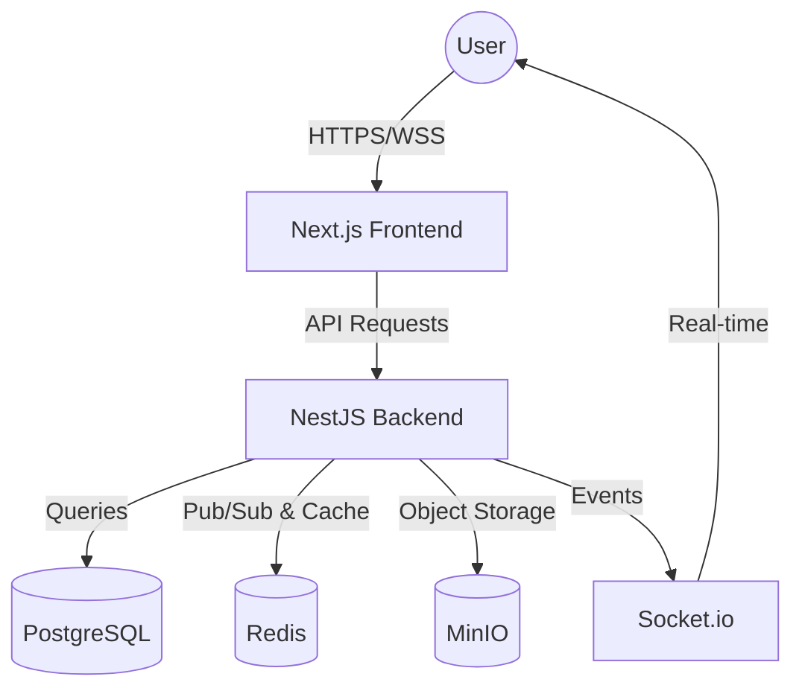
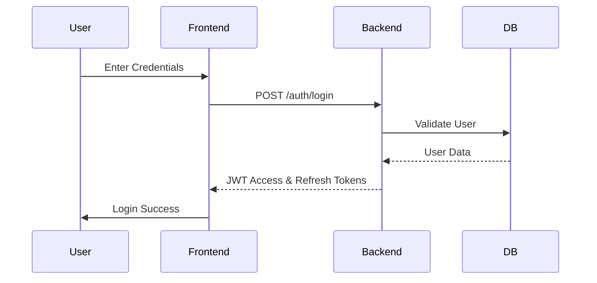
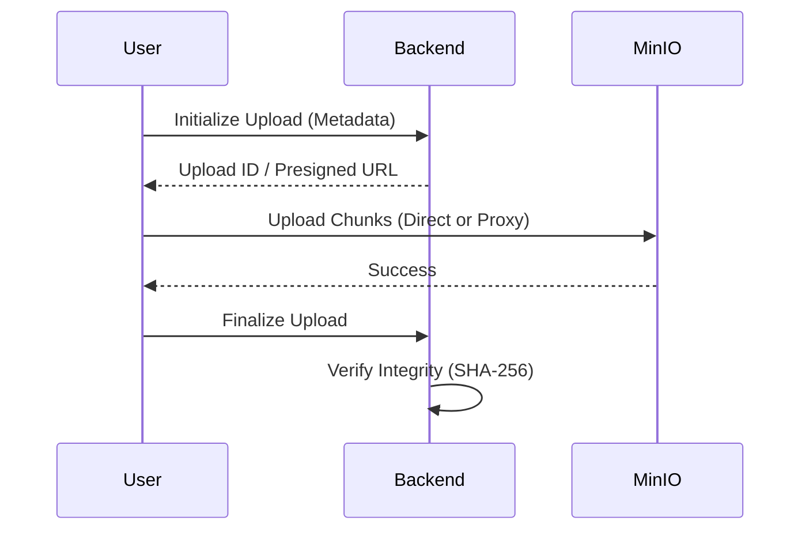

# Enterprise LAN Messenger & File Sharing System

## Project Overview
An enterprise-grade, offline-first communication and file-sharing platform designed for secure organizational use within a Local Area Network (LAN). This system provides a self-hosted alternative to Slack or Microsoft Teams, ensuring that all data remains strictly within the organization's infrastructure.

### Key Features
- **Offline-First Architecture**: Works entirely without internet dependency.
- **Zero Trust Security**: Mandatory authentication and authorization for every request.
- **End-to-End Encryption**: AES-256-GCM encryption for messages and file metadata.
- **Real-Time Messaging**: Instant communication via WebSockets.
- **Large File Sharing**: Support for multi-gigabyte files with chunked uploads/downloads.
- **Role-Based Access Control (RBAC)**: 6 distinct organizational roles.
- **Audit Logging**: Comprehensive tracking of system activities.

### Technology Stack
- **Frontend**: Next.js, TypeScript, TailwindCSS, ShadCN UI
- **Backend**: NestJS, TypeScript, TypeORM
- **Database**: PostgreSQL
- **Cache**: Redis
- **Storage**: MinIO (S3-Compatible)
- **Real-Time**: Socket.io
- **Security**: JWT, Argon2, AES-256-GCM

---

## Architecture Diagrams

### System Architecture


### Authentication Flow


### File Upload Flow


---

## Prerequisites
- Docker & Docker Compose
- Node.js (v18+ recommended)
- PostgreSQL (v14+)
- Redis (v6+)
- MinIO

---

## Installation & Setup

### Local Development Setup

1. **Clone the repository**:
   ```bash
   git clone <repository-url>
   cd enterprise-lan-messenger
   ```

2. **Backend Setup**:
   ```bash
   cd backend
   npm install
   cp .env.example .env
   # Edit .env with your local credentials
   npm run start:dev
   ```

3. **Frontend Setup**:
   ```bash
   cd ../frontend
   npm install
   cp .env.local.example .env.local
   # Edit .env.local with Backend API URL
   npm run dev
   ```

### Docker Deployment
The easiest way to deploy the entire stack is using Docker Compose.

```bash
docker-compose up -d
```
This will start:
- `db`: PostgreSQL Database
- `redis`: Redis Cache
- `minio`: MinIO Object Storage
- `backend`: NestJS API
- `frontend`: Next.js Web App

---

## Environment Variables

### Backend (`.env`)
| Variable | Description | Example |
|----------|-------------|---------|
| `DATABASE_URL` | PostgreSQL connection string | `postgres://user:pass@db:5432/db` |
| `JWT_SECRET` | Secret key for signing JWTs | `a-very-secure-random-string` |
| `ENCRYPTION_KEY` | 32-char key for AES-256 | `12345678901234567890123456789012` |
| `MINIO_ENDPOINT`| MinIO server address | `minio` |
| `REDIS_URL` | Redis connection string | `redis://redis:6379` |

---

## Running Tests
```bash
# Backend tests
cd backend
npm run test        # Unit tests
npm run test:e2e    # E2E tests

# Frontend tests
cd frontend
npm run test
```

---

## Production Deployment
For production on a Linux/Ubuntu server:
1. **Configure Static IP**: Ensure the server has a static LAN IP (e.g., `192.168.1.100`).
2. **Setup Reverse Proxy**: Use Nginx to handle SSL (optional for LAN) and port 80/443 mapping.
3. **Firewall**: Allow ports `80`, `443`, and `9000` (MinIO API).
4. **Hardening**: Change all default passwords and secrets in `.env`.

---

## Backup & Recovery
- **Database**: Use `pg_dump` for daily PostgreSQL backups.
- **Files**: Sync the MinIO data directory to an external drive or backup server.
- **Restore**: Use `psql` to restore database dumps and copy files back to the MinIO volume.

---

## Troubleshooting
- **Connection Refused**: Check if containers are running (`docker ps`) and firewall rules.
- **WebSocket Disconnects**: Ensure the reverse proxy (Nginx) is configured for WebSockets.
- **Upload Fails**: Check MinIO bucket permissions and available disk space.
